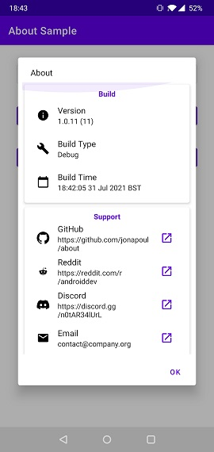
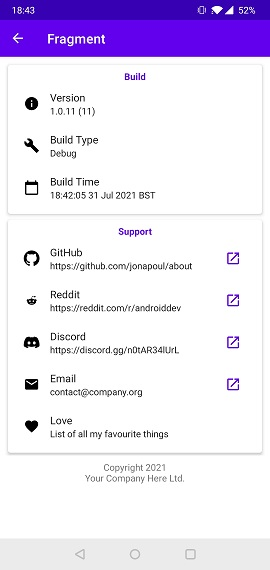
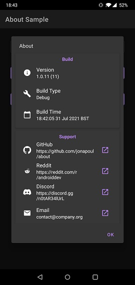
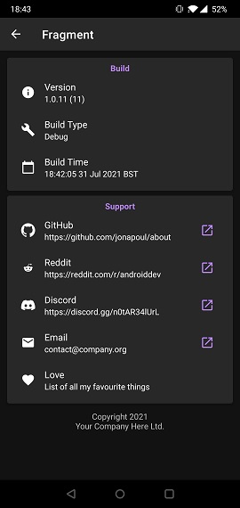

# about


[](https://jitpack.io/#jonapoul/about)

## Summary
A collection of two useful views/fragments that I use all the time, specifically for displaying "about my app" information in either a `AlertDialog` or a `Fragment`. It's not a particularly complicated library but it's nice to keep it in a single place.

## API Reference
See [https://jonapoul.github.io/about](https://jonapoul.github.io/about).
 
## Gradle Import
Root-level `build.gradle`:
```gradle
allprojects {
    repositories {
        maven { url "https://jitpack.io" }
    }
}
```

Module-level `build.gradle`:
```gradle
dependencies {
    implementation "com.github.jonapoul:about:{version}"
}
```

## Screenshots

| Dialog light | Fragment light
|:--:|:--:|
 |  |

| Dialog dark | Fragment dark
|:--:|:--:|
 |  |

## Usage
### General
You'll need to construct one or more `AboutSection` objects to group one or more `AboutItem`s. Example below with a single section, although the screenshots above contain two:

```kotlin
    val sections = listOf(
        AboutSection(
            title = R.string.my_section_header,
            items = listOf(
                AboutItem.fromVersion(BuildConfig.VERSION_NAME, BuildConfig.VERSION_CODE),
                AboutItem.fromBuildType(BuildConfig.BUILD_TYPE),
                AboutItem.fromGithub("http://github.com/jonapoul/about"),
                AboutItem(
                    icon = R.drawable.my_icon,
                    title = "Raw String Title",
                    subtitle = "A value/subtitle goes here",
                    onClickButton = { ctx ->
                        Toast.makeText(ctx, "Hello world!", Toast.LENGTH_LONG).show()
                    }
                ),
                AboutItem(
                    icon = R.drawable.another_icon,
                    titleRes = R.string.title_resource,
                    subtitleRes = R.string.subtitle_resource
                ),
            )
        )
    )
```

The `title` attribute has a default value of null, which will cause that section to not display a title string (obviously).

`items` expects a list of `AboutItems`, each of which can be constructed manually or using a selection of predefined ones that I like to use. These are:

| Name | Parameters | Comments |
|:--:|:--:|:--|
| `fromEmail` | `emailAddress` | On click, this will launch your preferred e-mail client with a blank message to the `emailAddress` string. |
| `fromVersion` | `versionName`, `versionCode` | Expects the relevant `BuildConfig` string and integer values, respectively. |
| `fromBuildType` | `buildType` | Expects `BuildConfig.BUILD_TYPE` as a parameter. |
| `fromBuildTimeMs` | `buildTimeMs` | Requires a custom field to be set in your build.gradle file, defining the millisecond timestamp of the app build. Add as: `buildConfigField "long", "BUILD_TIME_MS", System.currentTimeMillis() + "L"` under the module's `defaultConfig` block. |

### Dialog
In your regular fragment/activity, call the following code:

```kotlin
    val sections = listOf(
        AboutSection(...),
        AboutSection(...)
    )
    AboutDialogBuilder(context)
        .setSections(sections)
        .useDefaultTitle()
        .useDefaultPositiveButton()
        .show()
```

or as a bit of shorthand:

```kotlin
    AboutDialogBuilder(context, useDefaults = true)
        .setSections(sections)
        .show()
```

This is subclassing a `MaterialAlertDialogBuilder`, so it can use the same methods for customising. `useDefaultTitle` gives the dialog a default title of "About" and `useDefaultPositiveButton` gives a default "OK" button which does nothing except dismiss the dialog.

### Fragment
Create a subclass as below:

```kotlin
class MyAboutFragment : AboutFragment(
    sections = listOf(
        AboutSection(...),
        AboutSection(...)
    )
)
```

Then you can freely add it to your navigation graph (or however else you handle fragments) as normal.

## Customisation

| Element | Style Attribute |
|:--|:--|
| Section header text | `colorPrimary` |
| Section CardView background | `cardBackgroundColor` |
| Item left-hand icon | `onSurface` |
| Item text | `onSurface` |
| Item right-hand button  | `colorPrimary` |
